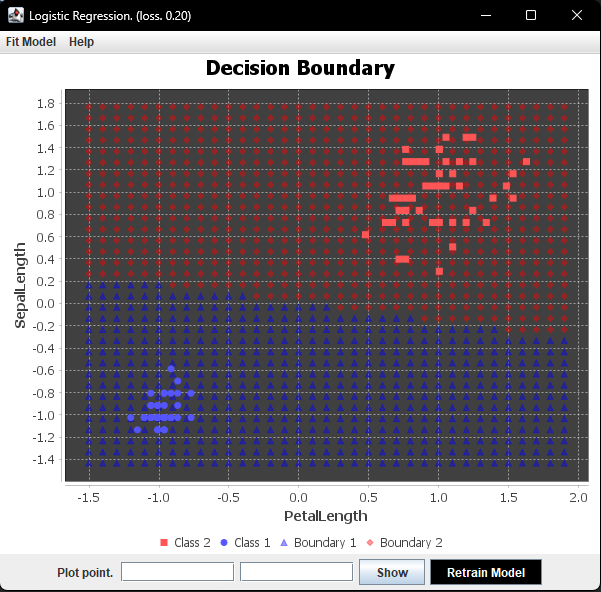

# Logistic Regression Package (Java)

**Logistic Regression** is a Machine Learning algorithm that estimates the probability of an instance
belonging to a particular class. For example, imagine we are tasked with building a Machine
Learning model to detect which customers are more likely to buy a product. The company can then focus 
on these customers by sending product samples to increase their chances of making a purchase. 
While **Logistic Regression** is effective for such tasks, it may not work well
in complex situacions, especially when we have large datasets, which is the case most of the time. 

## Technical Details
Now let's dive into the mathematics behind the **Logistic Regression** algorithm. We'll see the concepts,
equations and techniques that allows this algorithm to effectively estimate probabilities.

### Parameters
 * input_dim. The number of features in the dataset. $dim \in \mathbb{R}$
 * eta. The learning rate. $\alpha \in [0,1]$
 * weights. The weights of the model in order to compute the weighted sum. $\theta_i \in \mathbb{R}^{n \times 1}$
 * bias. The bias term in order to compute the weighted sum. $\theta_0 \in \mathbb{R}^{1 \times 1}$

### Forward propagation
Forward propagation is the process responsible for computing the prediction, which is the probability of 
an instance belonging in either class 0 or class 1.

We can set a threshold let's say 0.5, if the predicted
probability is higher than the threshold, then the instance will belong to class 1, else to class 0. Now, 
let's address the operations and calculations perform to the input data.

#### Parameters

Input Data
$X \in \mathbb{R}^{n \times m}$

True Labels $y \in \mathbb{R}^{1 \times n}$

Weights $\theta_i \in \mathbb{R}^{m \times 1}$

Bias Term $\theta_0 \in \mathbb{R}^{1 \times 1}$

#### Calculations

Weighted Sum $Z(x) = \theta_1x_1 + \theta_2x_2 + \theta_3x_3 + \cdots + \theta_nx_n + \theta_0$

Activation Function $\sigma(Z) = \hat{y} = \frac{1}{1 + e^{-Z}}$

Loss Function $L(\hat{y})= \frac{1}{n} \sum_i^n{y_i\ln{(\hat{y_i})} + (1-y_i)\ln{(1 - \hat{y}_i)}}$

### Backward propagation
Backward propagation is where the partial derivatives are computed, which we use
to update the parameters of the Logistic Regression model in order to improve the 
accuracy. The partial derivatives are computed with respect to the computed loss, 
the bigger the loss, the more our parameters will be adjusted.

**Weights Partial Derivative**

$\frac{\partial L}{\partial W} = \frac{\partial L}{\partial \sigma} . \frac{\partial \sigma}{\partial Z} . \frac{\partial Z}{\partial W}$

**Bias Term Partial Derivative**

$\frac{\partial L}{\partial b} = \frac{\partial L}{\partial \sigma} . \frac{\partial \sigma}{\partial Z} . \frac{\partial Z}{\partial b}$

# TO DO
- Add the Help text in the GUI
- Check the javadoc documentation in the code.

